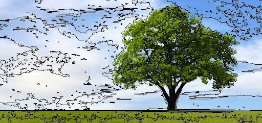
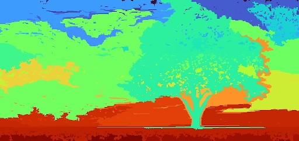

# Efficient Graph-Based Image Segmentation

This repository contains a Rust implementation of the graph-based image segmentation algorithms
described in `[1]` (available [here](http://cs.brown.edu/~pff/segment/)) 
focussing on generating over-segmentations, also referred to as superpixels.

| Contours                 | Labels                 |
|--------------------------|------------------------|
|  |  |

Please note that this is a reference implementation and not particularly fast.

```
[1] P. F. Felzenswalb and D. P. Huttenlocher.
    Efficient Graph-Based Image Segmentation.
    International Journal of Computer Vision, volume 59, number 2, 2004.
```

The implementation is based on [this work](https://github.com/davidstutz/graph-based-image-segmentation) by David Stutz,
which in turn was used in `[2]` for evaluation.

```
[2] D. Stutz, A. Hermans, B. Leibe.
    Superpixels: An Evaluation of the State-of-the-Art.
    Computer Vision and Image Understanding, 2018.
```

## Example use

```rust
fn main() {
    let mut image = imread("data/tree.jpg", IMREAD_COLOR).unwrap();

    let threshold = 10f32;
    let segment_size = 10;
    let mut segmenter = Segmentation::new(
        EuclideanRGB::default(),
        MagicThreshold::new(threshold),
        segment_size,
    );

    // NOTE: The image should be blurred before use; this is left out here for brevity.
    let labels = segmenter.segment_image(&image);
}
```
